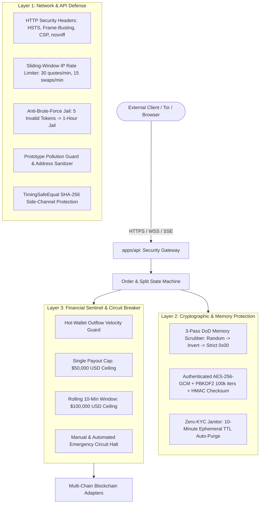

# CoinSwag — Enterprise Security Audit Brief & Technical Specification

**Target System**: CoinSwag Multi-Chain Zero-KYC Swap & Splitter Engine  
**Repository**: `https://github.com/thepros2014/CoinSwag.git`  
**License**: MIT Open-Source Software  
**Audit Scope Version**: `v1.0.0-rc1`  
**Test Suite**: `node scripts/test-all.cjs` (13 Suites, 100% Pass Rate)

---

## 1. Executive Summary & System Intent

CoinSwag is a non-custodial, peer-to-peer automated cross-chain swapping platform, multi-coin address splitter, and payment privacy router.

The core distinguishing architectural invariant is that **all cross-chain swaps between non-Monero cryptocurrencies are automatically routed through an intermediary Monero (`XMR`) Privacy Hub** (`Coin A ➔ XMR ➔ Coin B`). This breaks blockchain linkability by utilizing Monero's native Ring Signatures (RingCT), Stealth Addresses, and Bulletproofs+ to sever any graph connection between depositor and receiver addresses.

### Non-Custodial Operational Model
- **No User Accounts / No KYC**: The platform collects zero customer personal identifiable information (PII), email addresses, IP logs, or identity documents.
- **Ephemeral Keypairs & Zeroization**: Deposit addresses and transient swap session state are held purely in volatile RAM with a strict 10-minute Time-To-Live (TTL). Once settled or expired, a DoD 5220.22-M 3-pass cryptographic scrubber overwrites the memory.
- **Automated Payout Broadcast**: As soon as incoming deposits receive the required confirmations (or 0-conf for Bitcoin Lightning), the payout transaction is immediately signed and broadcast to the user's destination address.

---

## 2. In-Scope Components Matrix

| Component | Path | Language / Runtime | Primary Function |
| :--- | :--- | :--- | :--- |
| **Core Domain** | `packages/core/src/` | TypeScript / Node.js | Assets config, fee calculations, address format validators, DoD memory scrubber, AES-256-GCM vault cipher, swap state machine |
| **Blockchain Adapters** | `packages/blockchain/src/` | TypeScript / Node.js | Multi-chain adapters (BTC, Lightning, Monero, EVM, Solana), RPC failover manager, Tor SOCKS5 proxy gateway, mempool fee estimator |
| **Liquidity & Sweeper** | `packages/liquidity/src/` | TypeScript / Node.js | Automated fee sweeper (Realtime & Batch threshold modes), THORChain cross-chain routing gateway |
| **API Gateway** | `apps/api/src/` | TypeScript / Express | REST endpoints, SSE order streams, sliding-window rate limiter, anti-brute-force jail, timing-safe SHA-256 token verification, payload sanitizers |
| **Telegram Bot** | `apps/bot/src/` | TypeScript / Telegraf | Mini App swap interface, ephemeral order tracking, rate quotes |
| **Web Interface** | `apps/web/src/` | TypeScript / React / Vite | Swap UI widget, Split swap widget, QR code generators, deep links, legal disclaimer modal |

---

## 3. Threat Model & Security Controls



### Threat 1: User Data Exposure & Forensics
- **Mitigation**: CoinSwag operates without persistent database storage (Postgres/MySQL/MongoDB are intentionally omitted).
- **Control**: [`packages/core/src/security/memory-scrubber.ts`](file:///c:/Users/SnapCopy/OneDrive/Documents/CoinSwag/packages/core/src/security/memory-scrubber.ts) executes 3-pass zeroization over all sensitive byte arrays. Plaintext keys and mnemonics are scrubbed immediately after signature broadcast.

### Threat 2: Hot-Wallet Drainage & Rapid Exploits
- **Mitigation**: [`packages/blockchain/src/security/circuit-breaker.ts`](file:///c:/Users/SnapCopy/OneDrive/Documents/CoinSwag/packages/blockchain/src/security/circuit-breaker.ts) enforces strict velocity limits.
- **Controls**:
  - `MAX_SINGLE_PAYOUT_USD` (Default: $50,000): Any single transaction exceeding this ceiling automatically halts processing.
  - `MAX_VELOCITY_WINDOW_USD` (Default: $100,000): Rolling 10-minute cumulative outflow ceiling.
  - Emergency manual trip / reset APIs accessible only with operator authorization.

### Threat 3: Side-Channel Timing Attacks on Secret Tokens
- **Mitigation**: Token validation for order status or retrieval uses `TimingSafeEqual.compare(a, b)` in [`apps/api/src/security/timing-safe.ts`](file:///c:/Users/SnapCopy/OneDrive/Documents/CoinSwag/apps/api/src/security/timing-safe.ts), which hashes inputs with SHA-256 to ensure identical 32-byte buffers and compares them using constant-time `crypto.timingSafeEqual`.

### Threat 4: RPC Node Outage / Censorship / Sybil
- **Mitigation**: [`packages/blockchain/src/services/rpc-failover.service.ts`](file:///c:/Users/SnapCopy/OneDrive/Documents/CoinSwag/packages/blockchain/src/services/rpc-failover.service.ts) dynamically monitors node health, round-robin rotates across fallback endpoints upon 3 consecutive network failures, and routes Monero RPC queries through Tor SOCKS5 proxies (`XMR_USE_TOR=true`).

---

## 4. Out-of-Scope Items

1. **Third-Party Upstream Consensus**: Consensus bugs or 51% attacks on external L1 blockchains (Bitcoin, Ethereum, Monero, Solana).
2. **Upstream Remote RPC Integrity**: Malicious responses from external public RPC endpoints (mitigated at application level via multi-node failover and client-side transaction verification).
3. **End-User Device Compromise**: Malware, keyloggers, or compromised browser extensions on user client devices.

---

## 5. Audit Verification & Reproducibility Guide

Auditors can verify the entire test suite across all 13 security, core, and blockchain packages using a single command:

```bash
# 1. Clone repository
git clone https://github.com/thepros2014/CoinSwag.git
cd CoinSwag

# 2. Install dependencies
npm install

# 3. Compile all packages
node node_modules/typescript/bin/tsc -p packages/core/tsconfig.json
node node_modules/typescript/bin/tsc -p packages/blockchain/tsconfig.json
node node_modules/typescript/bin/tsc -p packages/liquidity/tsconfig.json
node node_modules/typescript/bin/tsc -p apps/api/tsconfig.json
node node_modules/typescript/bin/tsc -p apps/bot/tsconfig.json

# 4. Run the Master Verification Suite
node scripts/test-all.cjs
```

### Expected Output
```
================================================================
🛡️  CoinSwag Enterprise Pre-Audit Test Verification Suite
================================================================

▶ Running Core Fee & Monero Routing... ✅ PASSED
▶ Running Cryptographic Security & Memory Scrubber... ✅ PASSED
▶ Running Address Splitter Core Engine... ✅ PASSED
▶ Running Bitcoin Lightning Network (0-Conf)... ✅ PASSED
▶ Running RPC Failover & Node Health Manager... ✅ PASSED
▶ Running Tor SOCKS5 Privacy Gateway... ✅ PASSED
▶ Running Mempool Fee Estimator... ✅ PASSED
▶ Running Revenue Sweeper & Settlement Buffer... ✅ PASSED
▶ Running THORChain Cross-Chain Settlement... ✅ PASSED
▶ Running Telegram Bot Swap & Mini App... ✅ PASSED
▶ Running REST API & SSE Event Stream... ✅ PASSED
▶ Running Split Payment REST API... ✅ PASSED
▶ Running API Security Gateway & Anti-Brute-Force... ✅ PASSED

================================================================
📊 Audit Verification Results: 13 Passed, 0 Failed
================================================================

🎉 ALL 13 TEST SUITES PASSED! Codebase is ready for Enterprise Audit.
```
